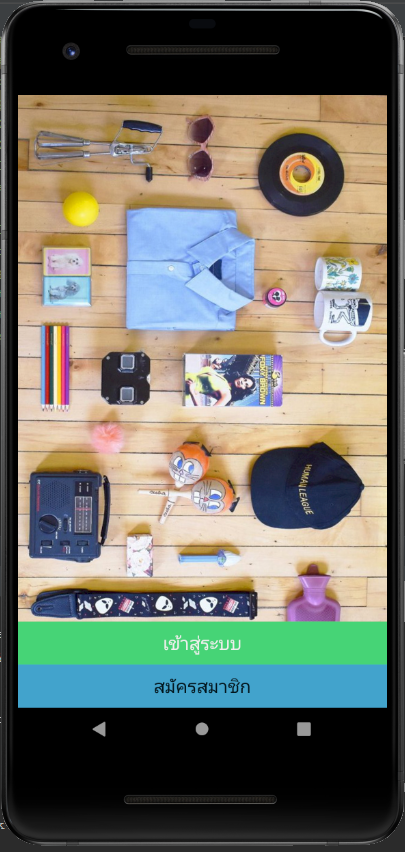

# แอปพลิเคชันแลกเปลี่ยนสิ่งของ Trader 

แอปพลิเคชันแลกเปลี่ยนสิ่งของ Trader คือแอปพลิเคชันที่เพิ่มความอำนวยสะดวกแก่ผู้ใช้ที่ไม่สะดวกใช้วิธีการแลกเปลี่ยนโดยการใช้เงิน ซึ่งใช้วิธีการแลกเปลี่ยนเป็นใช้สิ่งของแทน โดยการนำสิ่งของมาใช้ในการแลกเปลี่ยนเป็นอีกสิ่งหนึ่งจากอีกฝ่าย

---
Tools

- Kotlin
- MySQL
- Node.js as API
---
หน้าจอการทำงานของแอปพลิเคชัน

> หน้าแรก

  

